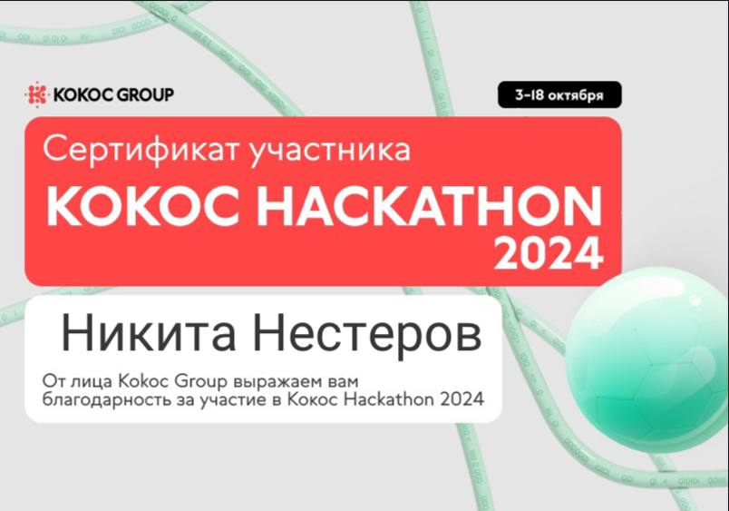
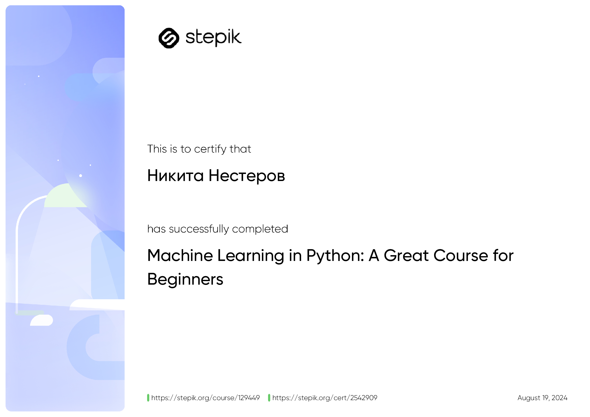
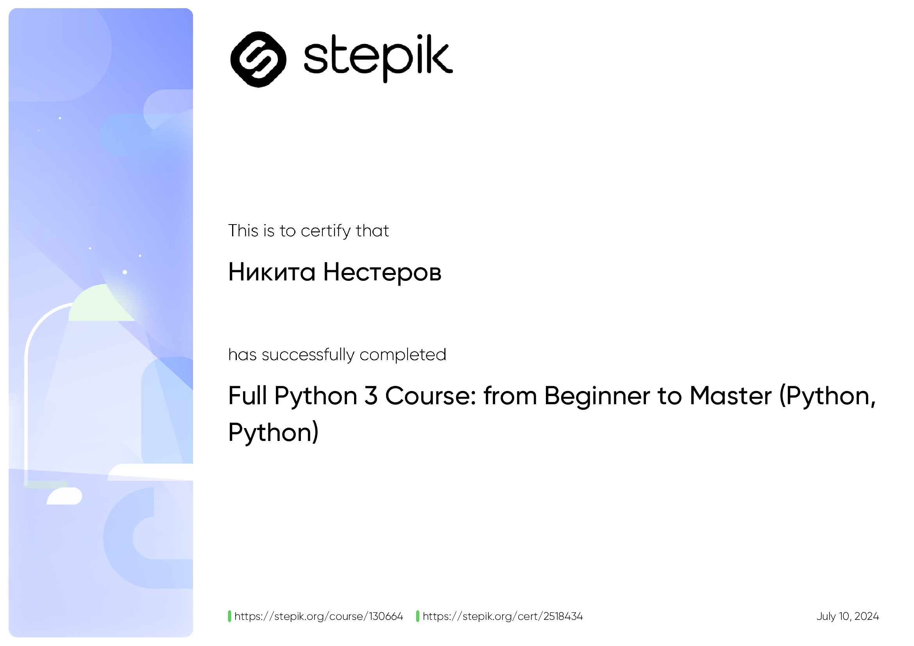

# 👋 Привет, я Никита Нестеров!

🔹 **Место:** Москва, Россия  
🔹 **GitHub:** [@akayooo](https://github.com/akayooo)  
🔹 **Telegram:** [@akayooooo](https://t.me/akayooooo)  
🔹 **Email:** nikita26.08.98nesterov@gmail.com  
🔹 **Языки программирования:** Python, SQL  
🔹 **Технологии:** PyTorch, AutoML (H2O, LightAutoML, AutoGluon), Scikit-learn, Pandas, Numpy, CatBoost, XGBoost, transformers

## 🚀 О себе
Я увлечён машинным обучением, анализом данных и разработкой AI-систем. Я участвую в различных хакатонах, где создаю решения на основе нейросетей и ML-моделей. Также работаю с AutoML инструментами для автоматизации задач классификации и регрессии.

🔹 **Образование:** NUST MISIS, Москва  
🔹 **Текущая специальность:** Разработчик/Инженер AI

## 📈 Статистика GitHub

## 🌟 Мои проекты
- **[Система рекомендаций товаров на основе LightGBM](https://github.com/akayooo/SBERxHSE_RecSys)** — Проект для рекомендаций товаров с использованием алгоритма LightGBM на основе музыкальных предпочтений пользователя.
- **[FAISS API для обработки текста](https://github.com/akayooo/FAISS-TextProcessingAPI)** — Разработка API для обработки текста с помощью FAISS и генеративных моделей.
- **[AutoML Pipeline для бинарной классификации](https://github.com/akayooo/AlphaHack_AutoML)** — Автоматизированный pipeline для бинарной классификации с использованием AutoGluon и LightAutoML.

## 💬 Связь
Для вопросов, предложений или сотрудничества вы можете обратиться ко мне через:
- 📧 **Email:** nikita26.08.98nesterov@gmail.com
- 💬 **Telegram:** [@akayooooo](https://t.me/akayooooo)

## 🎉 Кому я помогаю
Если вы:
- Хочете развить проекты с использованием AI и ML.
- Нуждаетесь в консультациях по применению AutoML решений.
- Ищете идеи для проектов, в которых использованы нейросети и обработки текстов.

Я с радостью помогу и поделюсь опытом!

---

## 🌍 Статистика активности на GitHub:

---

  

---
## Мои достижения

### Хакатоны
В этом разделе представлены сертификаты, полученные на хакатонах.

  
  
  

### Курсы
Здесь представлены сертификаты, полученные за прохождение курсов.

  
  

---

## 🔧 Навыки и Технологии

### Языки программирования:
- **Python**, **SQL**

### Области:
- **Классическое машинное обучение (Classical ML)**
- **Обработка естественного языка (NLP)**

### Технологии и библиотеки:
- **PyTorch**, **AutoML (H2O, LightAutoML, AutoGluon)**, **Scikit-learn**, **Pandas**, **Numpy**, **CatBoost**, **XGBoost**, **transformers**, **PostgreSQL**, **FAISS**, **Sentence Transformers**, **LangChain**

### Инструменты:
- **LaTeX**, **Git**, **Microsoft Office**, **Linux**, **Docker**, **MLFlow**, **Excel**

---

## ✨ Свой путь к AI

Мой путь в искусственный интеллект начался с университетских курсов по нейросетям и NLP, и с тех пор я увлечён разработкой решений на основе машинного обучения. Постоянно учусь и развиваюсь в этой области, участвуя в хакатонах и конкурсах.

---
